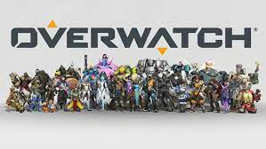
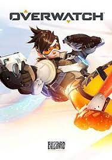
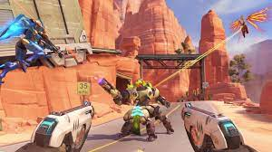

## My Favorite Game: Overwatch

What is my favorite game and why?

- My Favorite game of all time is Overwatch. Overwatch was the first time I realized I could achieve a really big goal. My goal was to be a Grandmaster on PC in competitive play. To achieve this goal I practiced and studied. It took me a year of hard work and I achieved it. I really like the strategy aspect of this game at the higher level, and how important teamwork was to winning. I made lifelong friends in this game around the world. 

What Company Made Overwatch?

- Overwatch was made by Blizzard Entertainment
- [blizzard.com](https://www.blizzard.com/en-us/)

When was it released?

- Overwatch was Released on May 24, 2016(My birthday!!!!!)

What Game Engine Was used

- Blizzard used the Game Engine Prometheus

##Images of the game:

